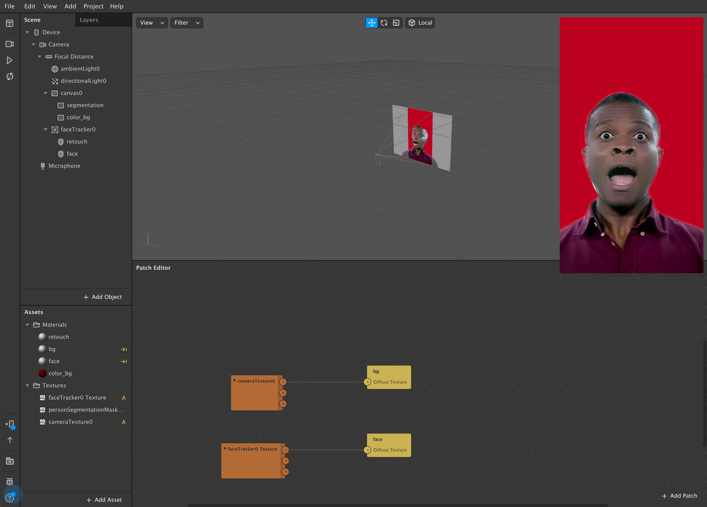

# Segmentation and Retouching in Spark AR

This example is based on this tutorial by Josh Beckwith:
[Spark AR Retouching with LUTs (and other texture effects)](https://www.youtube.com/watch?v=4g4CoL_KCkE)

